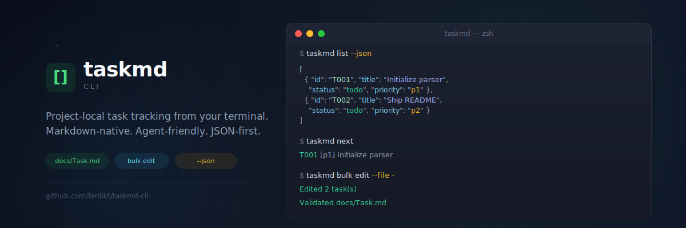

<p align="center">
  
</p>

<h1 align="center">taskmd</h1>

<p align="center">
  <strong>A powerful CLI for project-local task tracking</strong><br />
  Markdown-native · Agent-friendly · JSON-first · CI-ready
</p>

<p align="center">
  <a href="#-status"></a>
  <a href="#-quickstart"></a>
  <a href="#-installation"></a>
  
  <a href="#-agent-workflow"></a>
  <a href="#-license"></a>
</p>

---

## ⚠️ Status

> **This project is in public beta.** The core task lifecycle is implemented and tested end-to-end, but the format and command ergonomics may still evolve before `v1.0`. If you hit rough edges, open an issue.

---

## ✨ Why taskmd?

> Stop scattering tasks across chats, notes, and ad-hoc scratch files. Start **tracking work where the code lives.**

| | |
|---|---|
| 🧠 **Agent-first by design** | Deterministic commands, stable IDs, `--json` output, and JSON bulk mutations |
| 📝 **Markdown as source of truth** | Tasks live in `docs/Task.md`, readable by humans and writable by tools |
| 📦 **Single-file workflow** | No database, no background daemon, no account signup |
| 🔒 **Safe concurrent writes** | File lock + temp write + atomic rename |
| ⚡ **Fast local triage** | `taskmd next` picks the next highest-priority todo deterministically |

---

## 📦 Installation

<details open>
<summary><strong>Option 1 — Homebrew</strong> (recommended)</summary>

```bash
brew tap FerdiKT/tap
brew install taskmd
```

</details>

<details>
<summary><strong>Option 2 — Go install</strong></summary>

```bash
go install github.com/ferdikt/taskmd-cli@latest
```

</details>

<details>
<summary><strong>Option 3 — Build from source</strong></summary>

```bash
git clone https://github.com/FerdiKT/taskmd-cli.git
cd taskmd-cli
make tidy
make build VERSION=0.1.0
./bin/taskmd version
```

</details>

<details>
<summary><strong>Option 4 — Multi-arch release binaries</strong></summary>

```bash
make dist VERSION=0.1.0
ls dist/
```

See [`docs/RELEASE.md`](docs/RELEASE.md) for the release flow.

</details>

---

## 🚀 Quickstart

Get up and running in **2 minutes**.

### 1️⃣ Initialize the task file

```bash
taskmd init
```

This creates `docs/Task.md` in the repo root if you're inside a Git repository. Otherwise it creates it in the current directory.

### 2️⃣ Add your first tasks

```bash
taskmd add "Initialize parser" --priority p1 --labels cli,v1
taskmd add "Write README" --priority p2
```

### 3️⃣ See the queue

```bash
taskmd list
taskmd next
```

### 4️⃣ Move work forward

```bash
taskmd start T001
taskmd done T001
taskmd reopen T001
```

### 5️⃣ Use bulk JSON operations

```bash
cat <<'JSON' | taskmd bulk add --file -
[
  {"title":"Ship binary", "priority":"p1", "labels":["release"]},
  {"title":"Write docs", "priority":"p2"}
]
JSON
```

> **💡 Tip:** Use `taskmd list --json` and `taskmd next --json` when another CLI agent needs to consume the output.

---

## 🗺️ Command Map

| Area | Commands | Highlights |
|---|---|---|
| `core` | `init` · `list` · `show` · `version` | Project bootstrap and inspection |
| `lifecycle` | `add` · `edit` · `start` · `done` · `reopen` · `remove` | Stable IDs and explicit status changes |
| `bulk` | `bulk add` · `bulk edit` · `bulk remove` | JSON array input from file or stdin |
| `maintenance` | `next` · `fmt` · `validate` | Deterministic prioritization and file normalization |

> **Full reference:** `taskmd --help` · `taskmd <command> --help`

---

## 🤖 Agent Workflow

`taskmd` is optimized for local AI agents that are already comfortable with terminal workflows.

### Read path

```bash
taskmd list --json
taskmd show T001 --json
taskmd next --json
```

### Write path

```bash
taskmd add "Investigate flaky tests" --priority p1 --labels testing
taskmd edit T004 --notes "Repro found on macOS only"
taskmd bulk edit --file ./patches/tasks.json
```

### Validation path

```bash
taskmd fmt
taskmd validate
```

The canonical file format is strict enough for safe machine updates, but still readable enough for manual editing.

---

## 🧱 Canonical File Format

`taskmd` owns a stable Markdown layout:

```markdown
# Task

<!-- taskmd:version 1 -->

## Todo

### T001 - Initialize parser
- priority: p1
- labels: cli, v1
- created: 2026-04-09T14:30:00+03:00
- updated: 2026-04-09T14:30:00+03:00

#### Notes
Create the Markdown parser and renderer.

## In Progress

## Done
```

Rules:

- IDs are stable and never renumbered.
- Status is derived from the section, not duplicated in metadata.
- `Notes` is optional and accepts raw Markdown.
- `taskmd fmt` rewrites the file back into canonical form.

---

## 📊 Bulk Patch Model

Bulk commands accept JSON arrays.

```bash
cat <<'JSON' | taskmd bulk edit --file -
[
  {"id":"T001","notes":"Parser skeleton ready"},
  {"id":"T002","labels":[]},
  {"id":"T003","priority":"p1"}
]
JSON
```

Patch semantics:

- Missing fields are left unchanged.
- `""` clears string fields such as `notes`.
- `[]` clears labels.

---

## 🔒 Safety Model

Every write operation follows the same flow:

1. Acquire a file lock on `docs/Task.md.lock`
2. Parse the current Markdown document
3. Apply the mutation in memory
4. Write to a temp file
5. Atomically rename into place

This keeps local multi-agent workflows from trampling each other.

---

## 🧪 Development

```bash
make tidy
make test
make build VERSION=0.1.0
make dist VERSION=0.1.0
```

---

## 📄 License

MIT

